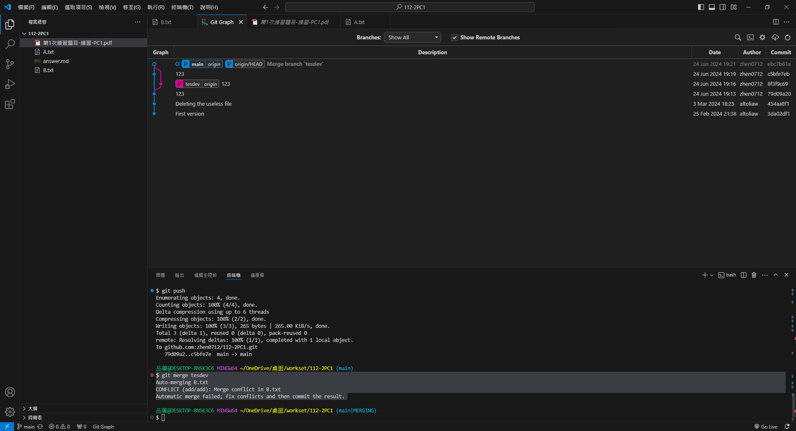

# 第1次練習-練習-PC1
>
>學號：1234567
> 
>姓名：王小明
> 
>作業撰寫時間：180 (mins，包含程式撰寫時間)
> 
>最後撰寫文件日期：2023/09/22
>

本份文件包含以下主題：(至少需下面兩項，若是有多者可以自行新增)
- [x] 說明內容
- [x] 個人認為完成作業須具備觀念

## 說明程式與內容

## 個人認為完成作業須具備觀念

這次的作業內容需要對基本的建立檔案、提交與推送有一定的理解，並且要會運用分支與分支合併，必須知道每一個碼都要做甚麼事情。